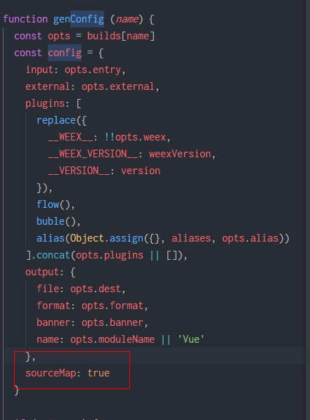
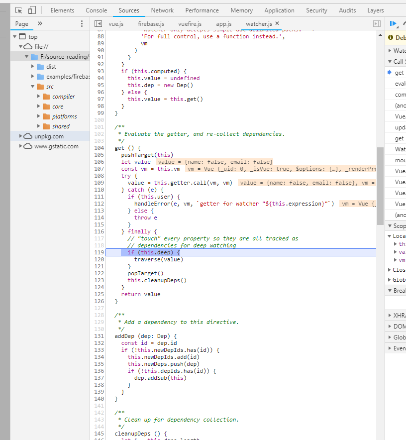
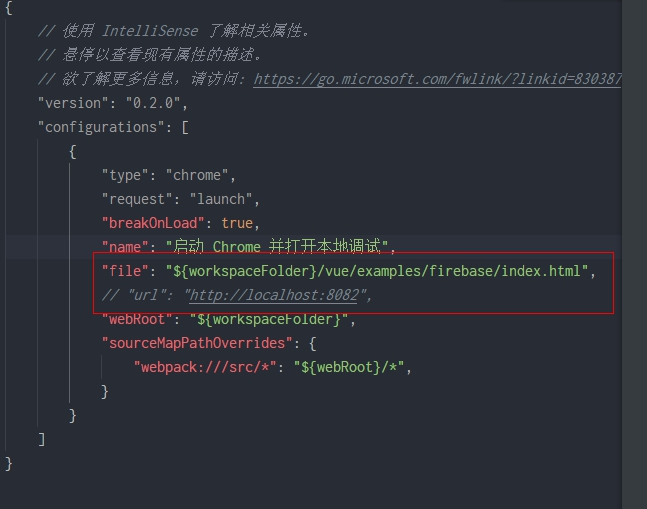
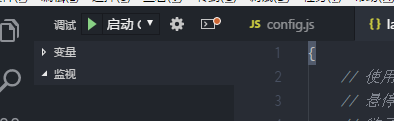
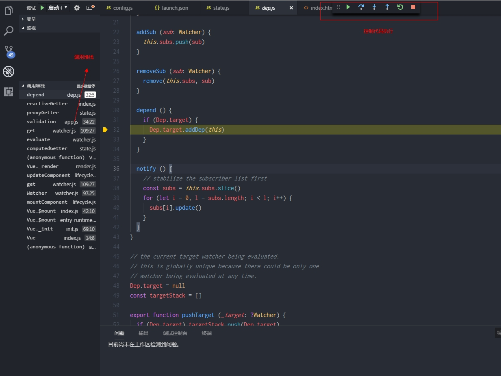
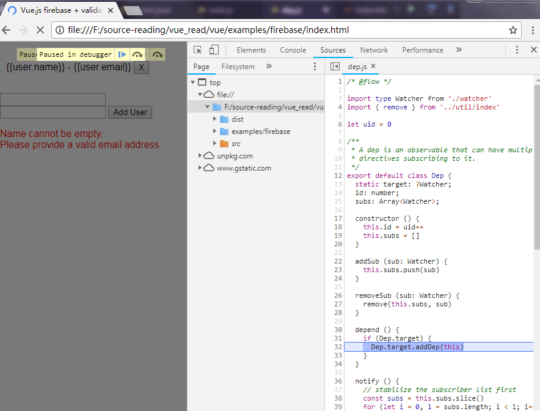

## 如何调试vue源码

1. 下载代码到本地

   ```bash
   git clone git@github.com:vuejs/vue.git
   ```

2. 修改打包的生成配置

   1. 找到scripts下的config.js文件

   2. 在genConfig函数中添加一行配置 `sourceMap = true`

      

   3. rollup 重新打包

      ```bash
      npm run dev 
      ```

3. 在chrome中调试

   找到examples文件夹，随意找一个例子，debugger调试

   

   可以在chrome中看到vue的打包前的源码了

4. 在vscode里面调试

   在vscode中调试相比与在chrome中调试的优点是可以直接跳到相应的文件，并可以写些自己的理解和注释。

   1. 在vscode中装 Debugger for Chrome 插件

   2. 在右边的activity bar中找到调小蜘蛛调试按钮，点击配置调试信息

      

      其中file字段写你要调试例子的html文件路径

   3. 在相应的js文件中打断点

   4. F5或者点击启动按钮启动调试

      

   5. 在编辑器中调试代码

      

      如果想看当前的变量信息，可以在插件打开的chrome中打开控制台辅助查看

      